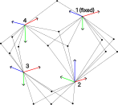

# About opall

Opall is a simple C++23 implementation of alignment of point clouds given point-to-point correspondences. Opall uses Ceres Solver under the hood.
While there are many implementations of an alignment of 2 point clouds, using algorithms like Umeyama or Horn, opall focuses on the alignment of many point clouds in one optimization process (global batch alignment).
For example see the situation in the drawing below, where we have 4 scanning stations and point (landmark) measurements given for each of them. Each point is co-visible from 2 stations at least.



Opall assumes that exactly one station should be fixed in the optimization process. This is required to fix the position and rotation ambiguity. User can specify approximated poses of aligned scans or let the opall find the initial guesses. In the later case the first pose will be fixed for optimization. Opall is a simple "vanilla style" optimizer. For each landmark it adds "observed point" cost functors to the Ceres problem. For each cost functor the rotation of the scan station is parametrized as a unit quaternion (so called S3 Lie group), while position belongs to R3. Opall assumes the observations are outlier free. Opall does not perform any RANSAC-like tests before solving optimization. However, you can choose any loss function available in Ceres to suppress the influence of inaccurate measurements on the final solution.

There is no detailed documentation available (yet). Please see the input files provided as exemplary data.

This repository provides:
- opall: static library
- opall_solver_app: application that uses pall internaly.

# Building library and app
## Windows Configuration and Build
### Prerequisites
To build opall in Windows you will need:
- Microsoft Visual Studio compatible with C++23. This build was tested with Microsoft Visual Studio Community 2022 v. 17.12.4.
- Windows Power Shell should be available on your PC.
- Git Bash or other GitHub client.
- CMake version at least 3.23. These build instructions were tested with CMake 3.31.2.
- vcpack (see next section on instruction how to install)
### vcpack setup
vcpack is a package manager maintained by Microsoft. It provides easy installation of C++ 3rd party dependencies. Installing vcpack makes installing 3rd party libraries much easier than building them from scratch in Windows. To install vcpack see [instructions](https://learn.microsoft.com/en-us/vcpkg/get_started/get-started?pivots=shell-powershell) or just execute following few steps:
- Fist clone vcpack to some top directory in your PC (can be something like D:/MyC++Tools or whatever with not an extremally long path):
  
```bash
git clone https://github.com/microsoft/vcpkg.git
```
  
- In Windows Power Shell navigate to main vcpack directory, and run the bootstrap script:

```bash
.\bootstrap-vcpkg.bat
```
That's it - vcpack is installed on your machine.
  
### Cloning the repository
Somewhere in your hard drive, where you have read/write access, create directory named `opall`. Navigate to the `opall` directory and clone repository: In Git Bash run:
```bash
git clone https://github.com/kubakolecki/opall.git
```

### Setting up the CMake and vcpack build environment
- So far you should have your top level `opall` directory and the cloned source directory `opall` inside. Next to the source directory create and empty
build directory named 'opall_build' (we will refer to this directory as build directory or build folder). **Now in your top level `opall` directory you should have two directories: source directory `opall` and an empty build directory `opall_build`**.

- Inside the source directory `opall` create Windows Power Shell script file named `configure_environment.ps1`. Add the following content to the script:
```bash
"configuring vcpkg environment ..."
$env:VCPKG_ROOT = location/where/my/vcpkg/is/installed"
$env:PATH = "$env:VCPKG_ROOT;$env:PATH"
vcpkg.exe integrate install
"configuration done"
```
Replace the `location/where/my/vcpkg/is/installed` with the path pointing to the directory where you installed vcpack i.e. the directory where `vcpkg.exe` file is located.

- In Windows Power Shell navigate to the source directory and execute `configure_environment.ps1` script:

```bash
.\configure_environment.ps1
```
This script will add the vcpack location to the system `PATH` variable and make include directories of the 3rd party dependencies visible to Visual Studio.

- Inside the source directory `opall` you should have `CMakePresets.json` preset file. Next to this file create `CMakeUserPresets.json` file that will contain user specific presets.
Add the following content to the newly created `CMakeUserPresets.json` file:

```json
{
    "version": 2,
    "configurePresets": [
      {
        "name": "default",
        "inherits": "vcpkg",
        "environment": {
          "VCPKG_ROOT": "location/where/my/vcpkg/is/installed"
        }
      }
    ]
  }
```
- Replace the `location/where/my/vcpkg/is/installed` with the path pointing to the directory where you installed vcpack i.e. the directory where `vcpkg.exe` file is located.

### Generating Visual Studio Solution
In Windows Power Shell navigate to the `opall` source directory and generate the solution in CMake, using the following command:
```bash
cmake --preset=default
```
CMake configuration when run first time may take longer time because vcpack needs to download all dependencies like Ceres Solver, Eigen, Suit Sparse.
If no errors are reported you should have Visual Studio solution file created in `opall_build` directory. All dependencies are installed in `opall_build\vcpkg_installed` folder.
### Building opall
- Open solution file `opall.sln` in Visual Studio.
- **Double check if in the main Visual Studio toolbar Release mode is enabled!**
- In the solution explorer in `CMakePredefinedTargets` right click on BUILD_ALL project and build it.
This should compile and link opall library and opall_app. Hopefully no errors will occur.
- After successful build, the binaries are available in `opall_build/bin`.
### Checking if build works
- In Windows Power Shell navigate to `opall_build\bin\opall_solver_app\Release`.
- Display information about the version of opall_solver_app:
```bash
.\opall_solver_app -v
```
- Information about the version should be displayd.
### Running on the sample data
- In Windows Power Shell navigate to the top level `opall` directory.
- Run the opall_solver_app on the first data sample:
```bash
 .\opall_build\bin\opall_solver_app\Release\opall_solver_app -p .\opall\sample_data\simulation_01\solver_input\poses.txt -m .\opall\sample_data\simulation_01\solver_input\lidar_measurements.txt -c .\opall\sample_data\simulation_01\solver_config.cfg -o .\opall\sample_data\simulation_01\solver_output -r
```
- Hopefully you should have the Ceres Solver output printed on the screen. The report file should be created in the `solver_output` directory specified as the '-o' command line argument.
- In this example opall was used to optimize poses given their initial guesses, provided in the `poses.txt` file given as the `-p` command line argument.
- If no initial guess is provided, i.e. the `-p` command line argument is skipped, opall_solver_app will try to align poses incrementally. To achieve this the app will fix the coordinate system of the first point cloud, so the first pose given won't be optimized. Let's try this with second sample data set:
```bash
.\opall_build\bin\opall_solver_app\Release\opall_solver_app -m .\opall\sample_data\simulation_02\solver_input\lidar_measurements.txt -c .\opall\sample_data\simulation_02\solver_config.cfg -o .\opall\sample_data\simulation_02\solver_output -r
```
- Now you should see that the optimization was computed several times, once per each pose incrementally added to the optimization problem plus additional optimization at the end. The report file should be created in the `solver_output` directory.
- See [opall_solver_app CLI](https://github.com/kubakolecki/opall/tree/main?tab=readme-ov-file#opall_solver_app-cli) for more details about running Opall Solver App.
### Installing opall
This step is not required unless you want to use opall in your own C++ project. You may need to have run the Windows Power Shell as an admin. To install opall library and opall_app in Windows Power Shell navigate to the top level `opall` direcotry.
Install the binaries:
```bash
cmake --install .\opall_build\
```
CMake will install the binnaries as welll as CMake config files for using opall library in you future C++ projects.
### Using in your own project
When building your project with CMake you shuold be able to find opall package by adding `find_package` command in your 'CMakeLists.txt' file. For example:
```cmake
cmake_minimum_required(VERSION 3.30.0)
project(my_project)
find_package(opall REQUIRED)
```

## Linux Configuration and Build

### Prerequisites
- Git.
- CMake version at least 3.23. These build instructions were tested with CMake 3.31.2.
- gcc(g++) compiler. I used gcc version 14.2.0. So far build was not tested with Clang.

### Installing Ceres Solver and its dependencies
First you need to install Ceres Solver and its dependencies as described in [Ceres Solver Installation](http://ceres-solver.org/installation.html#linux).

### Cloning the repository
Somewhere in your hard drive, where you have read/write access, create directory named `opall`. Navigate to the `opall` directory and clone repository: In Git Bash run:
```bash
git clone https://github.com/kubakolecki/opall.git
```
### Building opall
- You should have the top level directory `opall` that contains source directory `opall` with the cloned source code. Next to the source directory `opall` create build directory named `opall_build`.
- In top level directory `opall` run project configuration:
```bash
cmake -B opall_build -S opall -DCMAKE_BUILD_TYPE=Release -DCMAKE_CXX_FLAGS_RELEASE="-O0"
```
The cmake build environment is now configured. As you see we are configuring with `-DCMAKE_CXX_FLAGS_RELEASE="-O0"` flag, which means lowest level of compiler optimization. In g++ I got wrong results while building with `-O1` or higher. This is not the case when building with Visual Studio.

- Build the binaries:
```bash
cmake --build opall_build -j 4
```
Hopefully no errors should occur.

- Similarly as after Windows build you can now test the binaries using sample data. Navigate to the top level `opall` directory.
  
dataset 1:
```bash
 ./opall_build/bin/opall_solver_app/opall_solver_app -p ./opall/sample_data/simulation_01/solver_input/poses.txt -m ./opall/sample_data/simulation_01/solver_input/lidar_measurements.txt -c ./opall/sample_data/simulation_01/solver_config.cfg -o ./opall/sample_data/simulation_01/solver_output -r
```
dataset 2:
```bash
./opall_build/bin/opall_solver_app/opall_solver_app -m ./opall/sample_data/simulation_02/solver_input/lidar_measurements.txt -c ./opall/sample_data/simulation_02/solver_config.cfg -o ./opall/sample_data/simulation_02/solver_output -r
```

See description in Windows build for more information about sample datasets.

# opall_solver_app CLI
To get infomration about Opall Solver App Command Line Interface run opall_solver_app with `-h` or `--help` argument. You should see the output like this:
```
          --help,  -h, help, Prints out help.
       --version,  -v, version, Prints out app version.
        --config,  -c, config, Path to config file.
  --measurements,  -m, measurements, Path to file with point measurements.
         --poses,  -p, poses, Path to file with approximated poses. If not provided the app will try to solve the alignment sequentially.
        --output,  -o, output, Path to the directory with app output.
     --overwrite,  -r, overwrite, Explicitly allows to overwrite existing data in the output direcory.
```
In general there are 3 arguments that are mandatory: `--config`, `--measurements` and `--output`. They specify the path to config file, path to measurement file and path to an output folder.
- Config file provides basic configuration of optimization problem setup and solver options. See exemplary config files in the sample data sets.
- Measurements file contains 3D point (landmark) measurements. See exemplary files in the sample data sets.
- Output folder shows the location of the directoy where the app output is written.
- If you use specify poses the solver will use them as the initial guesses for the solver.
